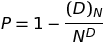

# Birthday problem solver in Kotlin

This project calculates the generalized birthday problem in the Kotlin language using the `BigDecimal` class. It can be used from the command line as a standalone application or as a dependency from another project.

## Synopsis

Treats the generalized birthday problem for arbitrary values.
                 
Calculates the generalized birthday problem, the probability `P` that, when sampling uniformly at random `N` times (with replacement) from a set of `D` unique items, there is a non-unique
item among the `N` samples. In the original birthday problem formulation, `N` is 23 and `D` is 366 (or 365) for a risk of `P` ≈ 0.5 = 50% of at least two people having the same birthday.

In mathematical terms, this can be expressed as

since the probability of picking all of `N` unique is equal to the number of ways to pick `N` unique samples divided by number of ways to pick any `N` samples. This, of course, given
the assumption that all `D` items are equally probable.
 
The project supports calculating both the probability `P` from `N` and `D` (using exact method, exact method with Stirling's approximation in the calculation of faculties and Taylor approximation) and
`N` from `D` and `P` (Taylor approximation only). Both approximations get asymptotically close to the exact result as `D` grows towards infinity. The exact method should not be used for larger
numbers. For extremely small probabilities `P`, the exact method with Stirling's approximation used for faculties may become unstable as it involves many more different operations than
the Taylor approximation which, each, results in small round-offs. Another source of error in this case arises from the use of Stirling's formula for two calculations of faculties (`D!`
and `(D - N)!`). Since one of these (`(D - N)!`) diverges slightly more from the exact result than the other (`D!`), the difference between these (used for calculations in log space) might
introduce small errors when `P` is extremely small. A good check to see whether the approximation in question is suffering or not is to compare it to the Taylor approximation and see
whether they match well.

### Parameter legend

Name | Type | Effect | CLI flag
--- | --- | --- | ---
`D` | integer | The size of the set to sample from | -
`N` | integer | The number of samples sampled from `D` | `-n`
`P` | floating point number | The probability of a non-unique sample in `N` | `-p`
`binary` | boolean | Whether to interpret `D` and `N` as base-2 logarithms | `-b`
`combinations` | boolean | Whether to interpret `D` as the size of a set from which we must yield the actual size, `D!`, of the set to sample from | `-c`  
`taylor` | boolean | Whether to calculate `P` with Taylor approximation | `-t`
`stirling` | boolean | Whether to calculate `P` with exact method using Stirling's approximation in calculation of faculties | `-s`
`exact` | boolean | Whether to calculate `P` with exact method | `-e`
`all` | boolean | Whether to calculate `P` with all methods (implies `-s -t -e`) | `-a`
`json` | boolean | Whether to output answer as a Json object or as text | `-j`
`prec` | integer | Decimals in the solution where applicable (in [0, 10] with default 10) | `--prec`
    
## Dependencies

* Xenomachina (kotlin-argparser) - https://www.kotlinresources.com/library/kotlin-argparser/
* Big-Math - https://github.com/eobermuhlner/big-math
* FastXML (Jackson-module-kotlin) - https://github.com/FasterXML/jackson-module-kotlin

## Versions

This project uses Kotlin 1.4.0 targetting Java 11.

## Usage 

### Gradle
The following shows
the usage in Gradle:

* To build project, run tests and create a thin jar (with no dependencies included), run `./gradlew build`
* To run tests only, execute `./gradlew test`
* To compile a thin jar (with no dependencies included) only, execute `./gradlew jar`
* To compile a fat jar with all dependencies included (except Kotlin runtime), execute `./gradlew fatJar`
* To run the standalone application with arguments, execute (for example) `./gradlew run --args="366 -n 23 -a"`

### Command-line

Command-line usage can be summarized with following input parameters:

    D [-n SAMPLES] [-p PROBABILITY] [-b] [-c] [-t] [-s] [-e] [-a] [-j] [--prec PREC]
    
The meaning of the flags can be found in the table further up.

When using the project on the command-line, transitive dependencies need to be included manually.

To compile the project on command-line, make sure all the listed dependencies are available and execute:

    > kotlinc -cp big-math-2.3.0.jar:kotlin-argparser-2.0.7.jar:jackson-core-2.11.3.jar:jackson-module-kotlin-2.11.3.jar:jackson-annotations-2.11.3.jar:jackson-databind-2.11.3.jar:. BirthdayProblemSolver.kt

To run the compiled classes with arguments, execute (for example):

    > kotlin -cp big-math-2.3.0.jar:xenocom-0.0.7.jar:kotlin-argparser-2.0.7.jar:jackson-core-2.11.3.jar:jackson-module-kotlin-2.11.3.jar:jackson-annotations-2.11.3.jar:jackson-databind-2.11.3.jar:. com.bdayprob.BirthdayProblem\$CLISolver 366 -n 23 -a
    
To run the compiled thin jar with arguments (no dependencies included), execute (for example):

    > kotlin -cp big-math-2.3.0.jar:xenocom-0.0.7.jar:kotlin-argparser-2.0.7.jar:jackson-core-2.11.3.jar:jackson-module-kotlin-2.11.3.jar:jackson-annotations-2.11.3.jar:jackson-databind-2.11.3.jar:BirthdayProblem-1.0.jar:. com.bdayprob.BirthdayProblem\$CLISolver 366 -n 23 -a

To run the compiled fat jar with arguments (all dependencies included except Kotlin runtime), simply execute (for example):

    > kotlin -cp BirthdayProblem-1.0-fat.jar com.bdayprob.BirthdayProblem\$CLISolver 366 -n 23 -a
    
or

    > java -jar BirthdayProblem-1.0-fat.jar 366 -n 23 -a
    
### Examples

Example usage of standalone application on command line (the longer version using `kotlin` command from above works as well in all cases):

#### Example 1
    
Calculate the probability `P` of at least one non-unique birthday among `N`= 23 persons with all available methods:

    > java -jar BirthdayProblem-1.0-fat.jar 366 -n 23 -a

#### Example 2:

Calculate, approximatively, the number of times `N` a deck of cards has to be shuffled to have a `P` = 50% probability of seeing a repeated shuffle:

    > java -jar BirthdayProblem-1.0-fat.jar 52 -p 0.5 -c

#### Example 3:

Calculate, with approximative methods,  the probability `P` of a collision in a 128-bit crypto when encrypting `N` = 2^64 = 18 446 744 073 709 551 616 blocks with the same key and output answer as a Json object with at most 5 decimals:

    > java -jar BirthdayProblem-1.0-fat.jar 128 -n 64 -b -s -t -j --prec 5
    
#### Help:

Use the following command on the standalone application to get information about usage:

    > java -jar BirthdayProblem-1.0-fat.jar --help
### As a dependency

The following shows example usage of this project in another application:

    import com.bdayprob.BirthdayProblem.Solver
    import com.bdayprob.BirthdayProblem.CalcPrecision
    import java.math.BigDecimal
    
    // Program.kt
    
    fun main() {
        val (p, pMethod) = Solver.solveForP(BigDecimal("366"), BigDecimal("23"), false, false, CalcPrecision.EXACT)
        val (n, nMethod) = Solver.solveForN(BigDecimal("52"), BigDecimal("0.5"), false, true)
    }
    
The program can then be compiled using Gradle or on the command line. With Gradle, simply add the relevant dependency (thin jar) to `build.gradle.kts`

    implementation(files("<PATH>/BirthdayProblem-1.0.jar"))
    
To compile on the command line, either use the thin jar and include all dependencies

    > kotlinc -cp big-math-2.3.0.jar:kotlin-argparser-2.0.7.jar:jackson-core-2.11.3.jar:jackson-module-kotlin-2.11.3.jar:jackson-annotations-2.11.3.jar:jackson-databind-2.11.3.jar:BirthdayProblem-1.0.jar:. Program.kt // compile
    > kotlin -cp big-math-2.3.0.jar:xenocom-0.0.7.jar:kotlin-argparser-2.0.7.jar:jackson-core-2.11.3.jar:jackson-module-kotlin-2.11.3.jar:jackson-annotations-2.11.3.jar:jackson-databind-2.11.3.jar:BirthdayProblem-1.0.jar:. ProgramKt// run
or use the fat jar:

    > kotlinc -cp BirthdayProblem-1.0-fat.jar Program.kt // compile
    > kotlin -cp BirthdayProblem-1.0-fat.jar:. ProgramKt // run
    
The functions to call has signatures

    fun solveForP(dOrDLog: BigDecimal, nOrNLog: BigDecimal, isBinary: Boolean, isCombinations: Boolean, method: CalcPrecision): Pair<BigDecimal, CalcPrecision>
    fun solveForN(dOrDLog: BigDecimal, pIn: BigDecimal, isBinary: Boolean, isCombinations: Boolean): Pair<BigDecimal, CalcPrecision>

and may throw exceptions.

## Author

Elias Lousseief (2020)

## Change log

* *v. 1.0*
* *v. 1.1*
  *  Added rounding upwards (ceiling) instead of regular rounding (half up) on non-logarithmic solutions for `N`.
  *  Removed output approximation character on non-logarithmic solutions for `N`.
  *  Added flag `--prec` for command-line interface allowing the user to choose output precision, where applicable, in [0, 10] with default 10.
    
